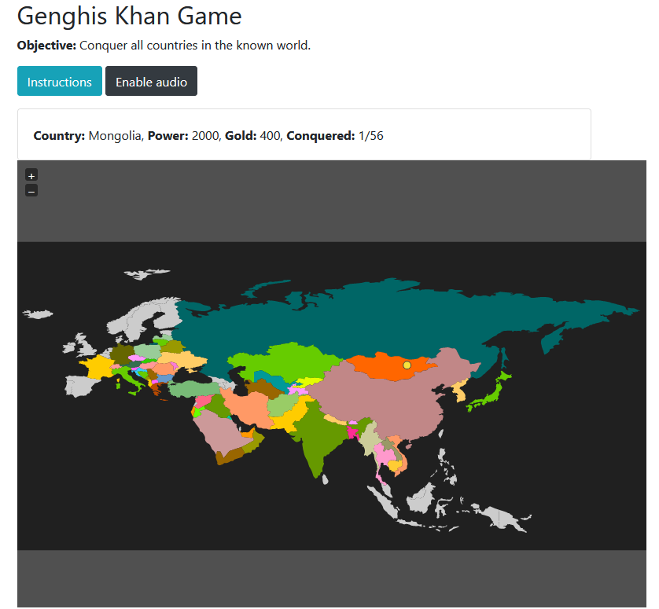
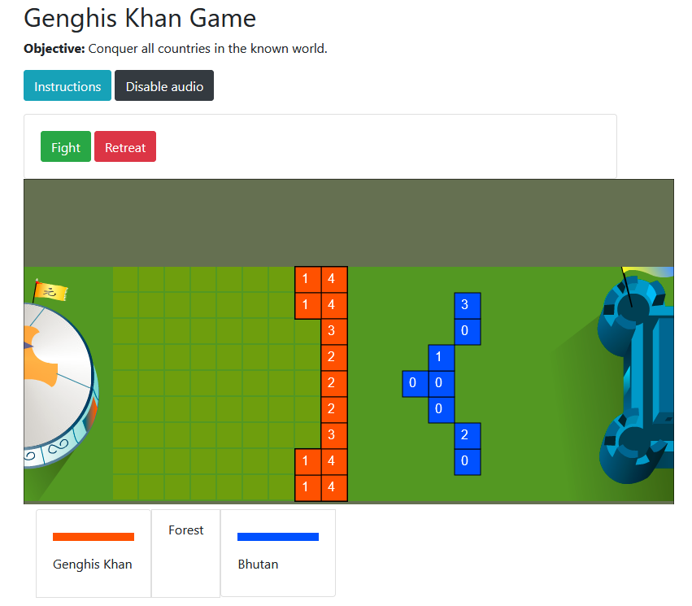

# genghis-khan-game

A HTML5 and Javascript remake of the Flash game "Genghis Khan"

The objective of the game is to conquer all countries in the known world.

## Getting Started

1. Clone the project

2. Install npm dependencies
```bash
cd genghis-khan-game
npm install
```

3. Build the project (compiles TypeScript to JavaScript)
```bash
npm run build
```

4. Start the server
```bash
npm start
```

Open your browser and navigate to `http://localhost:3000` to play the game.

### Running Tests

```bash
npm test
```

Screenshots
---

<div style="display:inline-block;">


</div>
